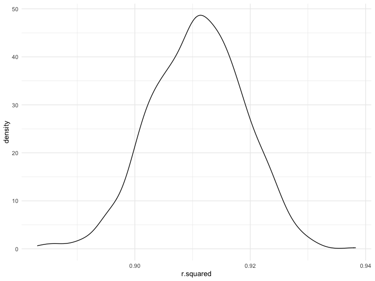
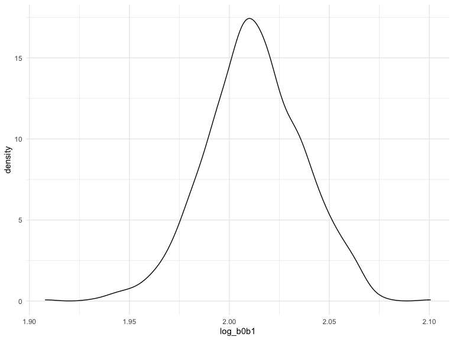

p8105_hw6_gl2761
================
Gonghao Liu
12/3/2022

## Problem 1

To obtain a distribution for $\hat{r}^2$, we’ll follow basically the
same procedure we used for regression coefficients: draw bootstrap
samples; the a model to each; extract the value I’m concerned with; and
summarize. Here, we’ll use `modelr::bootstrap` to draw the samples and
`broom::glance` to produce `r.squared` values.

### Loading data

``` r
weather_df = 
  rnoaa::meteo_pull_monitors(
    c("USW00094728"),
    var = c("PRCP", "TMIN", "TMAX"), 
    date_min = "2017-01-01",
    date_max = "2017-12-31") %>%
  mutate(
    name = recode(id, USW00094728 = "CentralPark_NY"),
    tmin = tmin / 10,
    tmax = tmax / 10) %>%
  select(name, id, everything())
```

    ## Registered S3 method overwritten by 'hoardr':
    ##   method           from
    ##   print.cache_info httr

    ## using cached file: ~/Library/Caches/R/noaa_ghcnd/USW00094728.dly

    ## date created (size, mb): 2022-12-03 15:04:05 (8.428)

    ## file min/max dates: 1869-01-01 / 2022-12-31

``` r
weather_df %>% 
  modelr::bootstrap(n = 1000) %>% 
  mutate(
    models = map(strap, ~lm(tmax ~ tmin, data = .x) ),
    results = map(models, broom::glance)) %>% 
  select(-strap, -models) %>% 
  unnest(results) %>% 
  ggplot(aes(x = r.squared)) + geom_density()
```



In this example, the $\hat{r}^2$ value is high, and the upper bound at 1
may be a cause for the generally skewed shape of the distribution. If we
wanted to construct a confidence interval for $R^2$, we could take the
2.5% and 97.5% quantiles of the estimates across bootstrap samples.
However, because the shape isn’t symmetric, using the mean +/- 1.96
times the standard error probably wouldn’t work well.

We can produce a distribution for $\log(\beta_0 * \beta1)$ using a
similar approach, with a bit more wrangling before we make our plot.

``` r
weather_df %>% 
  modelr::bootstrap(n = 1000) %>% 
  mutate(
    models = map(strap, ~lm(tmax ~ tmin, data = .x) ),
    results = map(models, broom::tidy)) %>% 
  select(-strap, -models) %>% 
  unnest(results) %>% 
  select(id = `.id`, term, estimate) %>% 
  pivot_wider(
    names_from = term, 
    values_from = estimate) %>% 
  rename(beta0 = `(Intercept)`, beta1 = tmin) %>% 
  mutate(log_b0b1 = log(beta0 * beta1)) %>% 
  ggplot(aes(x = log_b0b1)) + geom_density()
```



As with $r^2$, this distribution is somewhat skewed and has some
outliers.

The point of this is not to say you should always use the bootstrap –
it’s possible to establish “large sample” distributions for strange
parameters / values / summaries in a lot of cases, and those are great
to have. But it is helpful to know that there’s a way to do inference
even in tough cases.

## Problem 2

### Read in and clean data

``` r
homicide_df =
  read.csv("./data_WP/homicide-data.csv", na = c("", "Unknown")) %>% 
  mutate(
    city_state = str_c(city, ', ', state),
    resolved = case_when(
           disposition =="Closed without arrest" ~ 0,
           disposition =="Open/No arrest" ~ 0,
           disposition =="Closed by arrest" ~ 1
         )) %>% 
  subset(city_state!="Dallas, TX" & city_state!="Phoenix, AZ" & city_state!="Kansas City, MO" & city_state!="Tulsa, AL") %>%
  filter(victim_race == "White" | victim_race == "Black") %>%
  relocate(city_state)
```

### Analysis for Baltimore

``` r
baltimore_df = 
  homicide_df %>% 
  filter(city_state == "Baltimore, MD")

baltimore_fit = 
  baltimore_df %>% 
  glm(resolved ~ victim_age + victim_race + victim_sex, data = ., family = binomial()) 

baltimore_fit %>%
  broom::tidy() %>%
  mutate(OR = exp(estimate)) %>%
  select(term, log_OR = estimate, OR, p.value) 
```

    ## # A tibble: 4 × 4
    ##   term               log_OR    OR  p.value
    ##   <chr>               <dbl> <dbl>    <dbl>
    ## 1 (Intercept)       0.310   1.36  7.04e- 2
    ## 2 victim_age       -0.00673 0.993 4.30e- 2
    ## 3 victim_raceWhite  0.842   2.32  1.45e- 6
    ## 4 victim_sexMale   -0.854   0.426 6.26e-10

## Problem 3

### Load and clean the data for regression analysis.

``` r
birthweight_df = read.csv("./birthweight.csv") %>% 
  janitor::clean_names()

# Check missing value
sum(is.na(birthweight_df))
```

    ## [1] 0

``` r
birthweight_df = birthweight_df %>% 
  mutate(
    babysex = factor(babysex, ordered = FALSE),
    frace = factor(frace, ordered = FALSE),
    malform = factor(malform, ordered = FALSE),
    mrace = factor(mrace, ordered = FALSE)
  )
```

### Propose a regression model for birthweight.

``` r
model_1 = lm(bwt ~ ppbmi + delwt, data = birthweight_df) 

model_1 %>% broom::tidy()
```

    ## # A tibble: 3 × 5
    ##   term        estimate std.error statistic   p.value
    ##   <chr>          <dbl>     <dbl>     <dbl>     <dbl>
    ## 1 (Intercept)   2396.     53.3        45.0 0        
    ## 2 ppbmi          -38.0     3.32      -11.4 8.42e- 30
    ## 3 delwt           10.6     0.476      22.2 3.11e-103

``` r
plot = birthweight_df %>% 
  add_residuals(model_1) %>% 
  add_predictions(model_1) %>% 
  ggplot(aes(x = pred, y = resid)) +
  geom_point(alpha = 0.5) +
  geom_abline(slope = 0, intercept = 0, color = "red") +
  labs(
    title = "Residuals vs Fitted value Plot",
    x = "Fitted value",
    y = "Residuals"
  ) +
  theme(plot.title = element_text(hjust = 0.5))
```

Describe modeling process: 1. Firstly, load and clean data; 2. Then I
think “mother’s weight at delivery (pounds)” and “mother’s pre-pregnancy
BMI” my influence baby’s birth weight, so I use these two variables as
the predictors of the model; 3. Then I drew a “Residuals vs Fitted value
Plot”. From the plot, residual values are bounce around 0, which means
they are evenly distributed around 0. Therefore, it is a reasonable
model and I keep this model.

#### Compare your model to two others:

``` r
model_2 = lm(bwt ~ blength + gaweeks, data = birthweight_df)
model_3 = lm(bwt ~ bhead + blength + babysex + bhead * blength + bhead * babysex + blength * babysex + bhead * blength * babysex, data = birthweight_df)

cv_df = crossv_mc(birthweight_df, 100) %>% 
  mutate(
    train = map(train, as_tibble),
    test = map(test, as_tibble)) %>% 
  mutate(
    mod_1 = map(.x = train, ~lm(bwt ~ ppbmi + delwt, data = .x)),
    mod_2 = map(.x = train, ~lm(bwt ~ blength + gaweeks, data = .x)),
    mod_3 = map(.x = train, ~lm(bwt ~ bhead + blength + babysex + bhead * blength + bhead * babysex + blength * babysex + bhead * blength * babysex, data = .x))) %>% 
  mutate(
    rmse_1 = map2_dbl(.x = mod_1, .y = test, ~rmse(model = .x, data = .y)),
    rmse_2 = map2_dbl(.x = mod_2, .y = test, ~rmse(model = .x, data = .y)),
    rmse_3 = map2_dbl(.x = mod_3, .y = test, ~rmse(model = .x, data = .y))) %>%
  select(starts_with("rmse")) %>% 
  pivot_longer(
    everything(),
    names_to = "model", 
    values_to = "rmse",
    names_prefix = "rmse_") %>% 
  mutate(model = fct_inorder(model)) %>% 
  ggplot(aes(x = model, y = rmse)) + 
  geom_violin() +
  labs(title = "RMSEs for Each Model",
       x = "Model",
       y = "RMSE") +
  theme(plot.title = element_text(hjust = 0.5))
```

Based on the violin plot, we can find that model 1 has a higher error
rate than the other two models and model 3 has the smallest RMSE value.
Model 3 is more accurate than model 1 and model 2.
